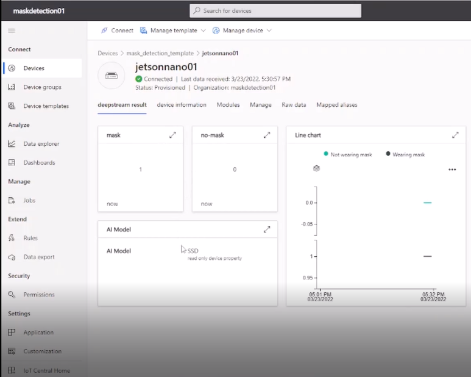

# Train And Deploy AI Model To Jetson Nano Using Nvidia Deepstream and Azure IoT Central
Edge is where the data resides and is collected in the field. Scalability issues, excessive power consumption, connectivity, and latency are some of the many factors driving the demand for Edge infrastructure in the form of micro-data centers or ants. distributed computing architecture. A recent study shows that the Edge computing market is expected to be worth at $3.24 billion by 2025.


Edge AI will enable real-time operations including data generation, decisions and actions where in milliseconds. Real-time operations are crucial for self-driving cars, robotics, and many other fields. Reducing power consumption and thus improving battery life is very important for wearable devices. Edge AI will reduce the cost of data communication, as less data will be transferred. By handling data locally, you can avoid the problem of streaming and storing a lot of data to the Cloud that makes you vulnerable from a privacy perspective.


This demo will be show how to deploy a mask detection application to [NVIDIA Jetson Nano device](https://developer.nvidia.com/embedded/buy/jetson-nano-devkit). Demo use [NVIDIA DeepStream SDK](https://developer.nvidia.com/Deepstream-sdk) for implementing AI application to achieve the best possible performance. With deepstream, AI application can reach to real-time for solving solution. Besides, [Azure IoT Central](https://azure.microsoft.com/en-us/services/iot-central/#features) will be used to manage and deploy application to Jetson Nano via [Azure IoT Edge](https://azure.microsoft.com/en-us/services/iot-edge/). IoT Edge gives you the possibility to run this pipeline next to your cameras, where the video data is being generated, thus lowering your bandwitch costs and enabling scenarios with poor internet connectivity or privacy concerns.


Currently covid 19 is happening , so this demo will implement an app that allows human mask wearing monitoring. Data will be displayed on IoT central for monitoring and analysis.


## Prerequisites
- Hardware: [NVIDIA Jetson Nano device](https://developer.nvidia.com/embedded/buy/jetson-nano-devkit), 5V-4A  power supply, USB camera, networking cable.
- A computer with GPU graphic card with OS Ubuntu 20.04. For example in demo uses Nvidia RTX 3060.
- Install docker in computer with GPU graphic card.
- Install IoT Edge: See the Azure IoT Edge installation instructions at [Microsoft Instruction](https://docs.microsoft.com/en-us/azure/iot-edge/how-to-provision-single-device-linux-symmetric?view=iotedge-2020-11&tabs=azure-portal%2Cubuntu).
- Install VLC to view RTSP video: On your developer's machine, [install VLC](https://www.videolan.org/vlc/index.html).
- Create a Microsoft Azure account at [here](https://azure.microsoft.com/en-us/free/).


## NVIDIA DEEPSTREAM SDK

- [NVIDIA DeepStream SDK](https://developer.nvidia.com/Deepstream-sdk) is a streaming analytic toolkit to build AI-powered applications with able to run deep neural networks real-time.

    [](https://developer.nvidia.com/Deepstream-sdk)

- Deesptream is a SDK based on GStreamer. User can create application as a pileline, which include a lot of plugins as decoder, encoder, stream mux... Each plugins have sinks and sources.
The input can be configured from some types of source as files, RTPS, camera and output can be displayed on display, saved to files or sent to cloud.

- This is an example of DeepStream pipeline:

    


## Azure IoT Central

Azure IoT Central is a cloud software as a service that lets easily connect, monitor, and configure IoT devices. Azure IoT Central reduces the burden and cost of developing, managing, and maintaining enterprise-grade IoT solutions. Choosing to build with IoT Central gives you the opportunity to focus time, money, and energy on transforming your business with IoT data, rather than just maintaining and updating a complex and continually evolving IoT infrastructure.

IoT central supports a collection of industry-specific application templates to accelerate solution development process. Azure IoT Central is platform suitable for enterprises which want to deploy IoT solution quickly. They can create solution easily instead of building complicated software and expensive infrastructure.

- Edge devices will connect to IoT Central through IoT edge service which installed in edge device.

    


## NVIDIA Jetson Nano

- For demo application, we use NVIDIA Jetson Nano device as edge device for inferencing mask detection application. 

    

- **NVIDIA Jetson Nano technical specifications.**
    


## Demo Tutorial
- This project will follow steps:
    - Train a mask detection model in GPU server using pytorch framework and export to ONNX format as input model of deepstream.
    - Create a Azure container registry.
    - Build a deepstream image for running AI application and a bridge image for sending insights as output of AI application to Azure IoT Central.
    - Create deployment manifest file which required by IoT central for deploying application to Jetson Nano.
    - Create Azure IoT central application. After that create a device template and a IoT device in this IoT central application.
    - Install IoT edge run Jetson Nano. Connect Jetson Nano to IoT central by using device connection information in IoT central.
    - View result of application through VLC and IoT central dashboard.

    Check out [this video](https://youtu.be/1xR_ar6eSmU) to see this demo and understand how it was built:

    [](https://youtu.be/1xR_ar6eSmU)


1. Train a mask detection model:
    - Copy training folder to GPU server.
    ```cmd
    docker run --gpus all  -it -v /home/ninhnn/training:/training nvcr.io/nvidia/pytorch:21.07-py3 /bin/bash
    cd /training
    python3 train_model.py
    ```
    - After model was trained successfully, check output model at output folder.

2. Create a Azure container registry:
    - For creating Azure container registry, please refer [this tutorial](https://docs.microsoft.com/en-us/azure/container-registry/container-registry-get-started-portal#:~:text=.azure.com.-,Create%20a%20container%20registry,contain%205-50%20alphanumeric%20characters.).

3. Build a deepstream image and a bridge image:
    - Install Azure CLI.
    ```cmd
    curl -sL https://aka.ms/InstallAzureCLIDeb | sudo bash
    ```
    - Login Azure account.
    ```cmd
    az login --use-device-code
    ```
    - Use link and code in output console to login azure account.
    - Login azure container registry.
    ```cmd
    az acr login --name your_azure_registry
    ```
    - Copy model onnx file and class_names.txt file to deepstream/deepstream_config folder
    - Modify input model for deepstream.
    ```cmd
    cd deepstream
    vim deepstream_config/config_infer_primary_ssd.txt 
    ```
    - Replace 'onnx-file' label with your model.
    - Build and push deepstream image to registry.
    ```cmd
    docker build -t your_azure_registry.azurecr.io/deepstream:latest .
    docker push your_azure_registry.azurecr.io/deepstream:latest
    ```
    - Build and push bridge image to registry.
    ```cmd
    docker build -t your_azure_registry.azurecr.io/bridge:latest .
    docker push your_azure_registry.azurecr.io/bridge:latest
    ```

4. Create deployment manifest file
    - Open deployment.json in deployment manifest folder.
    - Replace your azure container registry information in this file.
        

5. Create Azure IoT central application, a device template and a IoT device:
    - Create a Azure IoT central application. 
        Please refer [this tutorial](https://docs.microsoft.com/en-us/azure/iot-central/core/howto-create-iot-central-application).
    - Create a Device template:
        - In IoT central application, select device template tab and click on new.
        - Select Azure IoT Edge.
        - Enter a name and click on Review and Create.
        - Import a model, browse to file deployment manifest/device_template.json.
        - Select tab view and click on visualizing device template.

            
        
        - Enter name: deepstream result.
        - Drag a Last know value element, edit name to "mask" and add a telemetry capability "wearing mask", then click update.
        - Drag a Last know value element, edit name to "no-mask" and add a telemetry capability "Not wearing mask".
        - Drag a line chart and add 2 telemetry capabilities "wearing mask" and "Not wearing mask".
        - Drag a property element, edit name to "AI Model" and add a property capability "AI model".
        - Click on save, then click on back button.
        - Select tab view and click on visualizing device template again.
        - Enter name: device information.
        - Drag a property element, edit name to "device information" and add property capabilities as 'manufacturer', 'deviceModel, 'totalMemory', 'totalGPU', 'cpuArchitecture'.
        - Click on save, then click on back button.
        - Click on edit manifest tab. Replace with deployment manifest file at before step, then save and close.
        - Click on Publish.
    - Create a IoT device.
        - Select tab Device on top left.
        - Click on New, enter a device name and assign to a device template.
        - Click on Create.

6. Install IoT edge run Jetson Nano. Connect Jetson Nano to IoT central:
    - Install IoT edge run Jetson Nano: 
        Please refer [this tutorial](https://docs.microsoft.com/en-us/azure/iot-edge/how-to-provision-single-device-linux-symmetric?view=iotedge-2020-11&tabs=azure-portal%2Cubuntu) for installation.
    - After create IoT device in Azure IoT central, let click on device and select connect button, we can see connection information.
    - Remote to Jetson Nano.
    ```cmd
        ssh jetson_name@ip_address
    ```
    - User sets connection string to edge device
    ```cmd
    sudo cp /etc/aziot/config.toml.edge.template /etc/aziot/config.toml
    sudo vim /etc/aziot/config.toml
    ```
    - Replace id_scope, registration_id and sysmetric_key with device connection information in IoT central.

        

    - Apply configuration.
    ```cmd
    sudo iotedge config apply
    ```

7. View result of application through VLC and IoT central dashboard.
    - Check application run successfully in Jetson Nano.
    ```cmd
    sudo iotedge list
    ```

    - If 4 container run in jetson nano, then application run correctly.

        

    - View RTSP video in VLC.
        - Open VLC: in Media tab, select Open Network Stream.
        - Click on Network tab and enter rtsp://Jetson_IP:8554/ds-test
        - Click on Play and we can get result.

        

    - View result in IoT central.
        - Move to Azure IoT central application, then click on device in device tab, we can get the result of model and device information.

        
        

